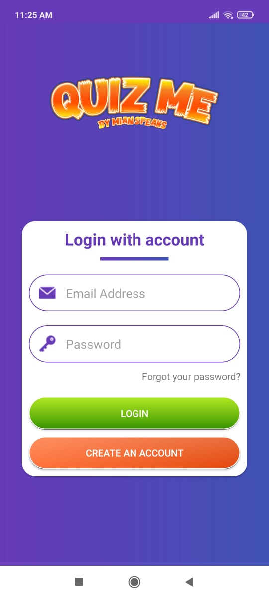
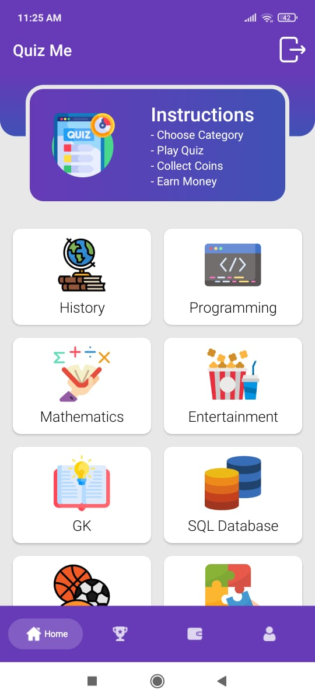
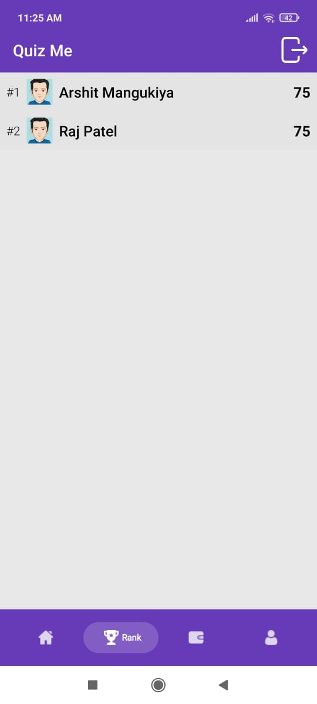
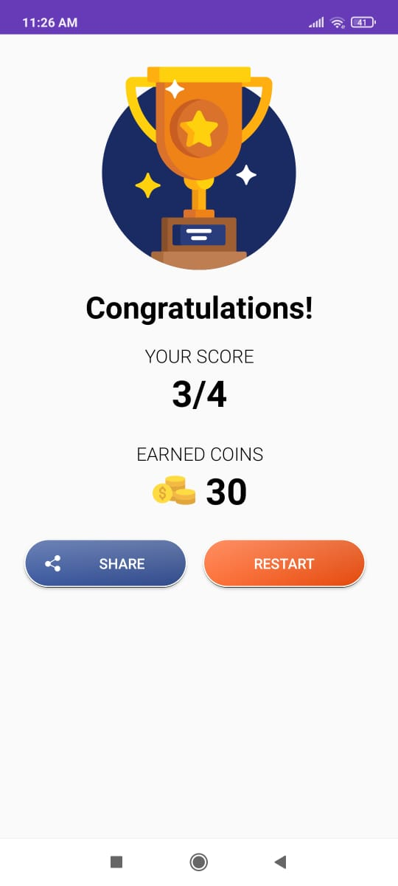
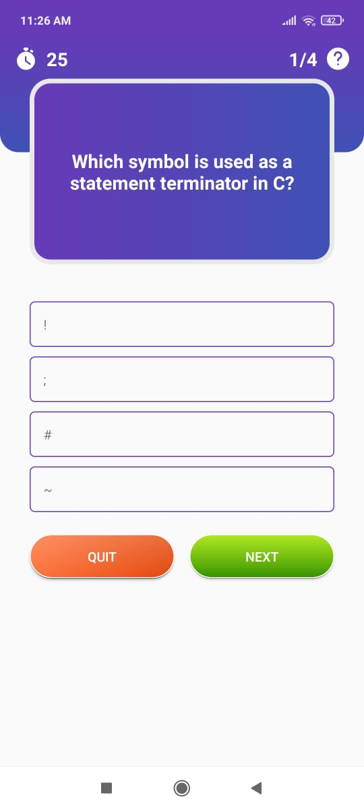

# Quiz-Application
This is Quiz Application which is made by me using Android Studio.  
Here are some UI photos of application.    
**1. Login Page**  
     
  
**2. Signup Page**  
    
  
**3. Home Page** - This page contains catogeries of quiz.  
    
  
  **4. Leaderboard Page**  
    
  
  **5. Wallet Page**  
    
  
  **6. Upadate Profile Page**  
    
  
  **7. ScoreBoard Page**  
    
 
  **8. Question Page**  
    
